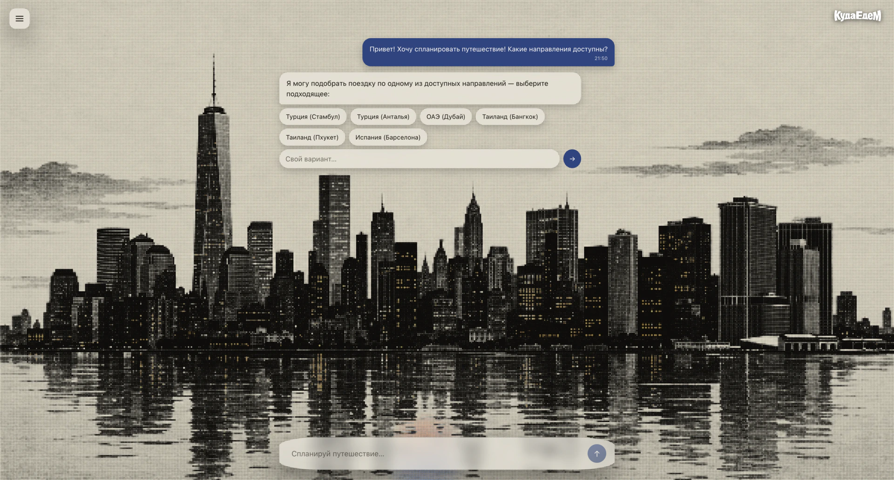
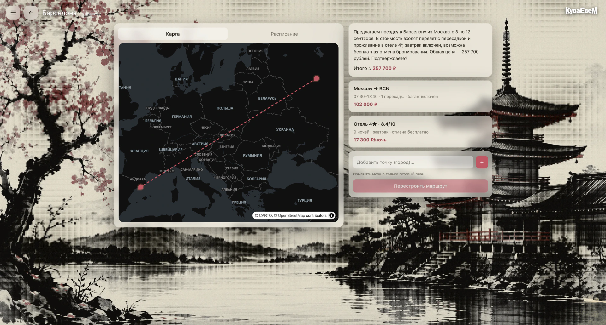

<div align="center">

# ✈️ Агент-планировщик путешествий

**ИИ-агент, который собирает поездку «под ключ».** Подбирает перелёты, отели и туры под состав
группы, бюджет, ограничения и предпочтения путешественников, отвечает на вопросы по правилам
сервиса и перестраивает план, как только меняются вводные.


<sub>Финальный проект курса «Промышленная разработка агентов»</sub>

<br>


<video src="https://github.com/user-attachments/assets/e62c1ba1-c356-42f0-97b9-93b6c4ef1c70" controls muted playsinline width="860"></video>

</div>

---

## Возможности

- **🧳 План поездки «под ключ».** Подбирает связку «перелёт + отель» (и пакетные туры) под
  направление, даты, состав группы и бюджет; показывает готовый вариант с маршрутом на карте,
  расписанием и итоговой стоимостью.
- **🔁 Перепланирование на лету.** Перестраивает вариант при изменении дат, бюджета или состава
  группы и при добавлении новых вводных — прямо в диалоге, кнопкой «Перестроить вариант».
- **👥 Учёт состава группы.** Опирается на профили путешественников (возраст, гражданство, домашний
  аэропорт, лояльность) и их предпочтения — как структурированные, так и в виде текстовых
  комментариев.
- **⚖️ Разрешение конфликтов предпочтений.** Ищет компромисс, когда пожелания внутри группы
  противоречат друг другу (ранние вылеты, питание, категория отеля, длительность пересадок).
- **💰 Контроль бюджета.** Укладывается в заданный бюджет и честно сообщает, когда подходящего
  варианта в рамках бюджета нет.
- **❓ Уточняющие вопросы.** Если данных не хватает, задаёт вопрос и предлагает варианты выбора
  (например, выбор направления кнопками) вместо того, чтобы угадывать.
- **🆘 Эскалация оператору.** Передаёт запрос человеку, когда решение нельзя принять автоматически.
- **📖 Ответы по правилам сервиса (RAG).** Отвечает на вопросы о тарифах, багаже, отмене, отелях и
  турах по базе из 5 документов с намеренно заложенными коллизиями и исключениями.
- **🧠 Память диалога.** Учитывает весь контекст беседы (мультитёрн) и хранит историю сессий, групп
  и планов в боковой панели.

---

## Скриншоты

<table>
  <tr>
    <td width="50%" valign="top">
      <br>
      <sub><b>Вход.</b> Стеклянная форма на «чернильных» фонах направлений.</sub>
    </td>
    <td width="50%" valign="top">
      <br>
      <sub><b>Старт.</b> «Куда отправимся?» — единое поле запроса к агенту.</sub>
    </td>
  </tr>
  <tr>
    <td width="50%" valign="top">
      <br>
      <sub><b>Диалог.</b> Агент уточняет направление кнопками-вариантами.</sub>
    </td>
    <td width="50%" valign="top">
      <br>
      <sub><b>История.</b> Группы, планы и сессии в боковой панели.</sub>
    </td>
  </tr>
</table>

<p align="center">
  <br>
  <sub><b>Готовый план.</b> Маршрут на карте, перелёт + отель, итоговая цена и кнопка «Перестроить вариант».</sub>
</p>

---

## Содержание

- [Возможности](#возможности)
- [Скриншоты](#скриншоты)
- [Архитектура](#архитектура)
- [Запуск проекта](#запуск-проекта)
- [Структура репозитория](#структура-репозитория)
- [Учебный кейс и данные](#учебный-кейс-и-данные)
- [Документация](#документация)

---

## Архитектура

В репозитории реализована полная трёхзвенная система:

| Модуль | Путь | Технологии | Роль |
|---|---|---|---|
| **Frontend** | [`frontend/`](./frontend/) | Vue 3 + TypeScript + Vite | Чат с агентом, карта маршрута, календарь, история сессий/групп/планов |
| **Backend (BFF)** | [`backend/`](./backend/) | FastAPI, SQLite, Alembic | Аутентификация, бизнес-данные, сессии/группы/планы, SSE, оркестрация агента |
| **Agent Service** | [`agent-service/`](./agent-service/) + [`agent/`](./agent/) | FastAPI + LangGraph, Chroma | Рассуждение, RAG по политикам, вызовы GigaChat (единственный LLM в системе) |

```text
браузер → frontend:5173 (nginx) ──/api──▶ backend:8000 ──Contract A──▶ agent-service:8001
                                              ▲                              │
                                              └──────── Contract B ──────────┘  ──▶ GigaChat
```

Глобальная архитектура и контракты подробно описаны в [`SPECIFICATION.md`](./SPECIFICATION.md)
(в каждом модуле есть свой `SPECIFICATION.md`).

---

## Запуск проекта

Для реального прогона нужны валидные учётные данные **GigaChat** (ключ `GIGACHAT_CREDENTIALS`,
scope `GIGACHAT_API_PERS`) — это единственный компонент, который обращается к LLM. Требуется сетевой
доступ к `ngw.devices.sberbank.ru:9443` (OAuth) и `gigachat.devices.sberbank.ru` (API).

### Вариант 1. Docker (рекомендуется)

Нужны Docker и Docker Compose v2.

```bash
cp .env.example .env          # затем заполнить значения (см. ниже)
docker compose up --build     # добавьте -d для фонового режима
# открыть http://localhost:5173
```

`.env` (в `.gitignore`, не коммитить) должен содержать реальные значения:

- `GIGACHAT_CREDENTIALS` — ключ авторизации GigaChat (scope `GIGACHAT_API_PERS`);
- `AGENT_SERVICE_TOKEN` и `BACKEND_TOOL_TOKEN` — два общих bearer-токена (любые длинные случайные
  строки); compose подставляет одно и то же значение в оба сервиса;
- `JWT_SECRET` — секрет для подписи пользовательских JWT.

Что происходит при `up`:

1. **backend** выполняет `alembic upgrade head`, поднимается на `:8000` и сидирует синтетические
   данные из `./data` (БД SQLite — в именованном томе `backend-db`, переживает рестарты);
2. **agent-service** дожидается готовности backend и при первом запуске строит RAG-индекс в
   `./data/indexes/policy_chroma` (нужен GigaChat), затем работает на `:8001` (внутренний);
3. **frontend** (nginx) отдаёт собранный SPA на `:5173` и проксирует `/api/*` (включая SSE) на backend.

Первый `up` дольше: образ агента большой, а построение RAG-индекса вызывает эмбеддинги GigaChat.
Полезные команды и детали — в [`docs/DOCKER.md`](./docs/DOCKER.md).

<details>
<summary><b>Вариант 2. Без Docker (локально)</b></summary>

<br>

Нужны [`uv`](https://docs.astral.sh/uv/) (Python 3.13) и `pnpm` + Node 20+. Каждый сервис
запускается в своём терминале.

```bash
# 0) Подготовьте gitignored .env-файлы:
#    backend/.env, agent-service/.env (из соответствующих .env.example) и ./.env (для RAG-индекса).
#    AGENT_SERVICE_TOKEN и BACKEND_TOOL_TOKEN должны совпадать в backend и agent-service.

# 1) RAG-индекс (однократно; читает ./.env, использует эмбеддинги GigaChat)
cd agent-service && uv sync --extra llm
uv run python ../agent/scripts/build_policy_index.py

# 2) Backend → http://localhost:8000
cd backend && uv sync && uv run alembic upgrade head   # миграции обязательны до первого старта
set -a; . ./.env; set +a
uv run uvicorn app.main:app --host 127.0.0.1 --port 8000

# 3) Agent Service → http://localhost:8001 (внутренний)
cd agent-service
set -a; . ./.env; set +a
uv run uvicorn agent_service.main:app --host 127.0.0.1 --port 8001

# 4) Frontend → http://localhost:5173 (против реального backend)
cd frontend && pnpm install
VITE_USE_MOCKS=false VITE_API_BASE=http://localhost:8000/api/v1 pnpm dev
```

> По умолчанию frontend работает на MSW-моках (без бэкенда) — удобно для разработки UI. Чтобы ходить
> в реальный backend, задайте `VITE_USE_MOCKS=false` (в production-сборке моки всегда выключены).

Подробный пошаговый runbook с проверками и smoke-тестами — в [`docs/LOCAL_E2E.md`](./docs/LOCAL_E2E.md).

</details>

---

## Структура репозитория

```text
frontend/          # Vue 3 SPA: чат, карта, календарь, история
backend/           # FastAPI BFF: API, auth, БД, SSE, оркестрация агента
agent-service/     # FastAPI + LangGraph: Contract A (/v1, runs+SSE) + RAG + GigaChat
agent/             # Исследовательские baselines (B1/B2/B3) + выбранный Final-граф
api/               # Замороженный OpenAPI-контракт frontend ↔ backend
data/              # Синтетические данные (RAG-документы, БД предложений, эталоны, Q&A)
docs/              # Runbooks (DOCKER.md, LOCAL_E2E.md) и проектная документация
docker-compose.yml # Полный стек из трёх контейнеров
SPECIFICATION.md   # Глобальная архитектура (+ модульные SPECIFICATION.md)
```

---

## Учебный кейс и данные

Агент подбирает билеты, отели и туры с учётом состава группы, бюджета, ограничений и предпочтений,
умеет перестраивать маршрут при изменении вводных. Он использует промпты, инструменты доступа к БД
предложений и к профилям путешественников (где предпочтения и ограничения частично заданы
структурированно, а частично — текстовыми комментариями), а также RAG по документам с правилами
сервиса.

В live-сценариях агент использует два уровня памяти: рабочую память диалога (`thread_id` + полный
transcript) и долговременную group-scoped память предпочтений. `MemoryAgent` извлекает из реплик
устойчивые предпочтения вроде «обычно не люблю ранние вылеты» или «багаж обязателен» и сохраняет их
через backend Contract B в `preferences`, чтобы следующие ходы уже видели эти факты как часть
контекста группы.

```text
data/
  documents/   # Политики сервиса для RAG (5 .md-документов)
  travelers/   # CSV: путешественники, группы, состав групп, перелёты, отели, туры
  reference/   # Эталонные рекомендации по перелётам и отелям
  qa/          # qa.jsonl (E2E-кейсы) + scenario_groups.md (описание сценарных групп)
  indexes/     # Сгенерированный Chroma-индекс RAG (gitignored)
```

<details>
<summary><b>Документы (RAG) — <code>data/documents/</code></b></summary>

<br>

1. `01_booking_rules.md` — правила бронирования, возвратов и изменений.
2. `02_baggage_and_fares.md` — ограничения тарифов, багаж, пересадки, ночные перелёты.
3. `03_hotel_policy.md` — правила по отелям, категориям, отменам, питанию, детям.
4. `04_package_tours.md` — правила подбора туров, трансферов и включённых услуг.
5. `05_agent_behavior.md` — регламент общения, эскалации, уточнения и пересчёта вариантов.

В документах намеренно заложены коллизии и исключения: тариф дешевле, но без багажа; семейный запрос
допускает пересадку не более 3 часов; для группы с ребёнком запрещены ночные прилёты; часть отелей
не допускает бесплатную отмену.

</details>

<details>
<summary><b>База путешественников и предложений (tools) — <code>data/travelers/</code></b></summary>

<br>

CSV-таблицы, которые backend импортирует в свою БД при старте:

- `travelers.csv` — профиль путешественника: возраст, гражданство, домашний аэропорт, лояльность,
  базовые ограничения.
- `traveler_preferences.csv` — предпочтения и текстовые комментарии (пляжный отдых, нелюбовь к ранним
  вылетам, нужен завтрак, 4*+, без долгих пересадок).
- `travel_groups.csv` — состав группы, бюджет, целевое направление, даты, ограничения по детям/визам.
- `group_members.csv` — связь группы с путешественниками.
- `flights.csv` — варианты перелётов: цены, тарифы, багаж, время вылета, пересадки.
- `hotels.csv` — варианты отелей: цена за ночь, категория, питание, рейтинг, политика отмены.
- `tours.csv` — пакетные туры.

Сценарные группы из `data/qa/scenario_groups.md` имеют заранее заданные профили и конфликтующие
предпочтения — их удобно использовать в QA и эталонной оценке.

</details>

<details>
<summary><b>Reference-датасет и Q&A для E2E-оценки — <code>data/reference/</code>, <code>data/qa/</code></b></summary>

<br>

**Reference — `data/reference/`**

- `flight_recommendations.csv` — эталонные рекомендации по перелётам для сценарных групп.
- `hotel_recommendations.csv` — эталонные рекомендации по отелям.

**Q&A — `data/qa/`.** Основной E2E-набор `data/qa/qa.jsonl`: каждый кейс описывает пользовательский
запрос, доступный контекст и ожидаемый тип исхода. Категории кейсов:

| Категория | Что проверяет |
|---|---|
| `info` | Ответы по правилам тарифов, отелей и путешествий |
| `planning` | Построение полного плана поездки под бюджет и группу |
| `replanning` | Перестройка варианта после изменения дат, бюджета или состава группы |
| `preference_conflict` | Обработка конфликтующих предпочтений внутри группы |
| `budget_limit` | Корректное поведение при нехватке бюджета |
| `clarification` | Запрос недостающих данных перед рекомендацией |
| `escalation` | Передача на оператора при невозможности принять решение автоматически |
| `edge_case` | Пограничные случаи: визы, дети, ночные рейсы, отсутствие подходящих отелей |

Ожидаемый исход (`expected_outcome_type`) — один из: `info`, `recommendation`, `clarification`,
`escalation`, `rejection`.

**Что использовать на каком этапе**

| Этап | Артефакты |
|---|---|
| Построение RAG | `data/documents/` → индекс `data/indexes/policy_chroma` |
| Инструменты доступа к данным | таблицы `data/travelers/*.csv` (импортируются в БД backend) |
| Отладка рекомендаций | `data/reference/flight_recommendations.csv`, `hotel_recommendations.csv` |
| Тестирование агента | свои кейсы или подмножество `data/qa/qa.jsonl` |
| Финальная E2E-оценка | весь `data/qa/qa.jsonl` + эталонные reference-файлы |

Метрики удобно считать отдельно по типам задач: точность выбора перелёта и отеля, корректность
укладывания в бюджет, качество учёта предпочтений, корректность запроса уточнений и реакции на
изменение требований.

</details>

---

## Документация

| Документ | О чём |
|---|---|
| [`SPECIFICATION.md`](./SPECIFICATION.md) | Глобальная архитектура и контракты A/B |
| [`frontend/SPECIFICATION.md`](./frontend/SPECIFICATION.md) | Текущее состояние фронтенда |
| [`backend/SPECIFICATION.md`](./backend/SPECIFICATION.md) | Текущее состояние backend (BFF) |
| [`agent-service/SPECIFICATION.md`](./agent-service/SPECIFICATION.md) | Текущее состояние agent-service |
| [`agent/SPECIFICATION.md`](./agent/SPECIFICATION.md) | Baselines и выбранный Final-граф |
| [`docs/DOCKER.md`](./docs/DOCKER.md) | Запуск в Docker: команды, тома, отладка |
| [`docs/LOCAL_E2E.md`](./docs/LOCAL_E2E.md) | Локальный запуск без Docker: пошаговый runbook |
